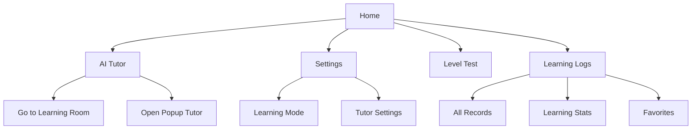

## “Foreign Language Learning Friends Who Chat with AI”

### Overview

1. Service Overview
2. Problem Definition and Solutions
3. Core Ideas and Features
4. Expected Effects
5. Demo Page Structure
6. Utilized Datasets
7. Expansion Directions
8. Conclusion

### 🎯 Service Overview
ChatterPals is a foreign language learning service that goes beyond simple grammar study, helping users develop real conversational skills through real-time dialogue with AI.

When a user is viewing actual content such as news, blogs, social media, or YouTube, the on-screen information is read by an AI tutor character, which then asks questions or provides feedback.

In this way, learners can naturally converse and learn in a foreign language anytime, anywhere.

### 🧩 Problem Definition and Solutions

**Existing Problems | ChatterPals’ Solutions**

- AI learning focuses mainly on grammar and vocabulary, weak in real conversation → Provides real-time voice-based interactive tutoring
- Repetitive learning structure makes it boring and unsustainable → Offers engaging, trend-based conversational topics
- Lack of personalized feedback → Provides grammar, pronunciation, and intonation feedback PDFs using personal learning data analysis
- Lack of real-life speaking experience → Simulates real conversations through AI voice chat and virtual environments

ChatterPals maximizes the core abilities of AI tutors — real-time interaction, personalized feedback, and immersive learning — helping users develop true conversational fluency to speak naturally with real foreigners.

### 🧠 Core Ideas and Features

**1️⃣ AI Tutor Character Popup**

- A cute AI learning partner character appears on the user’s screen
- Reads the context of the webpage, article, or social media post the user is viewing

→ Asks questions like “What do you think about this article?”
- The user answers in a foreign language, and the AI immediately provides grammar and pronunciation corrections with alternative expressions
- Learning records are automatically saved and offered as a monthly personalized feedback report (PDF)

**2️⃣ Learning Records and Statistics**

- Categorizes learning content by topic and platform (e.g., society, travel, hobbies, reviews, daily life)
- Allows users to check learning frequency, duration, and progress
- Favorite feature for managing preferred content

**3️⃣ Personalization and Tutor Customization**

- Adjusts learning style based on the learner’s level and goals
- Users can customize the tutor’s personality, voice, and appearance
- Allows selection of feedback tone (encouraging, strict, etc.)

**4️⃣ Level Test**

- Evaluates users based on voice recognition and sentence construction
- Diagnoses current level and recommends a personalized learning path

### 🚀 Expected Effects

- Enhances real conversational ability
- Corrects pronunciation and intonation through AI voice interaction
- Provides real-time feedback for natural sentence formation
- Improves learning consistency
- Uses trending topics from SNS and news to maintain interest
- Motivates users with gamified elements such as character popups, points, and challenges
- Accessible anytime, anywhere
- Mobile and web synchronization enables spontaneous conversation practice
- Enables learning like “reading an article on the bus → discussing it in English with AI”

### 🔍 Demo Page Structure

- **Home Screen** : Entry point with four menus (Tutor, Settings, Level Test, Logs)
- **AI Tutor** : Core interactive learning function (discussion, explanation, rephrasing)
- **Settings** : Adjusts learning style, tutor character, voice, and feedback tone
- **Level Test** : Evaluates proficiency and recommends a personalized curriculum
- **Learning Logs** : Visualizes learning data and tracks personal progress

### 📊 Utilized Datasets

| Source     | Dataset Name                                        | Purpose                                                  |
| ---------- | --------------------------------------------------- | -------------------------------------------------------- |
| AIHub      | Topic-Adaptive English Speaking Dataset for Koreans | Training real-time speaking evaluation models            |
| AIHub      | Korean-English Parallel Translation Corpus          | Context-based translation and response modeling          |
| AIHub      | Multilingual Daily Conversation Translation Dataset | Handling multilingual voice conversations                |
| Kaggle     | GPT-4 Multilingual Dialogue Dataset                 | Learning natural conversation simulation                 |
| SelectStar | Multilingual Conversation Dataset                   | Training models to handle various languages and contexts |

### 🌐 Expansion Directions

**Monthly Topic Challenges**: AI-user discussions on topics like environment and sports
**Brand-Linked Learning Missions**: Natural ad experiences within conversations
**VR/AR Conversation Simulations**: Practice real-life situations like airports, restaurants, or interviews
**Community Learning System**: Rankings, group discussions, and study sessions for enhanced social learning

### 💡 Conclusion

ChatterPals is a practical foreign language conversation learning platform that enables learners to chat and grow with AI.

Learn anytime, anywhere, and develop your real conversational skills with your adorable AI friends!