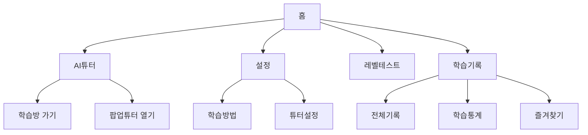

## “AI와 함께 수다 떠는 외국어 학습 친구들”

### Overview
1. 서비스 개요
2. 문제 정의 및 해결 방안
3. 핵심 아이디어 및 기능
4. 기대 효과
5. 데모 페이지 구성
6. 활용 데이터 셋
7. 확장 방향
8. 결론

### 🎯 서비스 개요

**ChatterPals(채터펠즈)**는 단순한 문법 학습을 넘어, AI와의 실시간 대화를 통해 실제 회화 감각을 키우는 외국어 학습 서비스입니다.

사용자가 뉴스, 블로그, SNS, 유튜브 같은 실제 콘텐츠를 보고 있을 때, 화면 속 정보를 AI 튜터 캐릭터가 읽고 질문을 던지거나 피드백을 제공합니다.

이로써 학습자는 언제 어디서든 자연스럽게 외국어로 대화하며 배우게 됩니다.

### 🧩 문제 정의 및 해결방안

**기존 문제	ChatterPals의 해결방안**

- AI 학습이 문법·단어 위주로, 실전 대화에 약함	실시간 음성 기반 대화형 튜터링 제공
- 반복 학습 구조로 지루함, 지속성 부족	최신 트렌드 주제 기반 흥미로운 대화 소재 제공
- 맞춤형 피드백 부족	개인 학습 데이터 분석을 통한 문법·발음·억양 피드백 PDF 제공
- 현실 회화 경험 부족	AI 음성 대화 및 가상 환경 기반 실전 회화 시뮬레이션

**ChatterPals**는 ‘AI 튜터의 핵심 능력’인 실시간 대화·맞춤형 피드백·몰입형 학습 경험을 극대화하여 사용자가 실제 외국인 앞에서도 막힘없이 말할 수 있는 진짜 회화력을 길러줍니다.

### 🧠 핵심 아이디어 및 기능

**1️⃣ AI 튜터 캐릭터 팝업**

- 사용자의 화면에 귀여운 AI 학습 파트너 캐릭터 등장
- 현재 보고 있는 웹페이지, 기사, SNS 글의 맥락을 읽어
→ “이 기사에 대해 어떻게 생각해?” 같은 질문 던짐
- 사용자는 외국어로 답변, AI는 즉시 문법·발음 교정 및 대체 표현 제안
- 학습 기록은 자동 저장되어 월간 **맞춤형 피드백 리포트(PDF)**로 제공

**2️⃣ 학습 기록 및 통계**

- 주제별/매체별로 학습 콘텐츠를 분류 (예: 사회·경제, 여행·취미, 리뷰·일상 등)
- 학습 횟수, 시간, 성취도 확인 가능
- 즐겨찾기 기능으로 관심 콘텐츠 관리

**3️⃣ 개인화 설정 및 튜터 커스터마이징**

- 학습자의 수준·목표에 따라 학습 스타일 조정
- 파트너 캐릭터의 성격, 음성, 외형도 직접 설정 가능
- 학습 피드백 톤도 선택 (격려형 / 엄격형 등)

**4️⃣ 레벨 테스트**

- 음성 인식 및 문장 구성 평가를 기반으로
- 현재 수준을 진단하고 개인별 학습 경로 추천

### 🚀 기대 효과

- 실전 회화 능력 강화

- AI 음성 대화로 발음·억양 교정 및 자연스러운 문장 구조 습득

- 실제 외국인과 대화하듯 실시간 피드백 제공

- 학습 지속성 향상

- SNS·뉴스 등 최신 트렌드 기반 주제 활용으로 흥미 유지

- 캐릭터 팝업, 포인트, 챌린지 등 게이미피케이션 요소로 동기 부여

- 언제 어디서나 학습 가능

- 모바일·웹 동기화로 이동 중에도 즉석 회화 가능

- “버스 안에서 기사 읽고 → AI와 영어로 토론” 같은 일상 학습 실현

### 🔍 데모 페이지 구성

- **홈화면** : 진입점으로 4개 메뉴(튜터, 설정, 레벨테스트, 기록) 제공
- **AI튜터** : 대화형 학습 중심 기능 (토론, 설명, 재설명)
- **설정** : 학습 스타일, 튜터 캐릭터, 음성, 피드백 톤 설정
- **레벨테스트** : 학습 수준 평가 및 커리큘럼 제안
- **학습기록** : 학습 데이터 시각화 및 개인 성취 추적

### 📊 활용 데이터셋

| 출처         | 데이터명                              | 활용 목적              |
| ---------- | --------------------------------- | ------------------ |
| AIHub      | 한국인의 주제적응형 영어말하기 평가데이터            | 실시간 말하기 평가 모델 학습   |
| AIHub      | 한국어-영어 번역(병렬) 말뭉치                 | 맥락 기반 번역 및 응답 모델   |
| AIHub      | 다국어 일상대화 실시간 통번역 데이터              | 다국어 음성 회화 대응       |
| Kaggle     | GPT-4 생성 다국어 대화 데이터셋              | 자연스러운 대화 시뮬레이션 학습  |
| SelectStar | Multilingual Conversation Dataset | 다양한 언어/상황 대응 모델 훈련 |

### 🌐 확장 방향

**이달의 토픽 챌린지**: 환경·스포츠 등 주제로 AI 및 사용자 간 토론
**브랜드 연계형 학습 미션**: 실전 대화 속 자연스러운 광고 경험
**VR/AR 회화 시뮬레이션**: 공항, 식당, 면접 등 현실 상황 훈련
**커뮤니티형 학습 시스템**: 랭킹, 그룹 토론, 스터디 세션 등 소셜 학습 강화

### 💡 결론

ChatterPals는 AI와 함께 수다 떨며 배우는, 실전 중심 외국어 회화 학습 플랫폼입니다.

언제 어디서나, 귀여운 AI 친구와 함께 “진짜 대화”로 성장하세요!